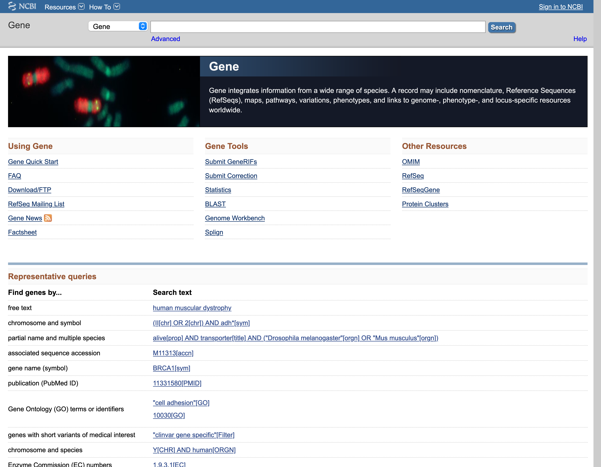
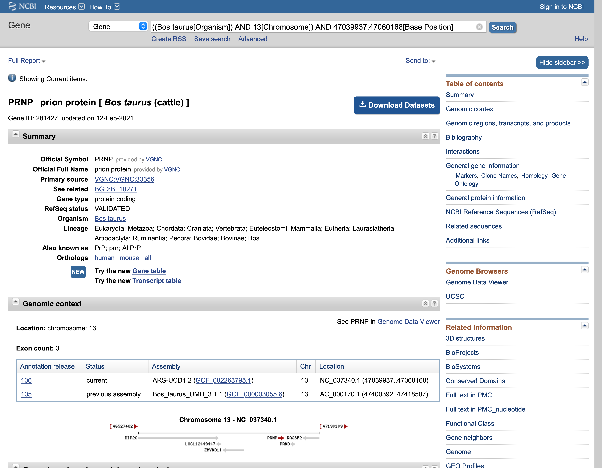

---
title: "Assignment 2"
author: [Course - Your name here]
colorlinks: TRUE
code-block-font-size: \footnotesize
...

# Assignment 2

Download the data associated with this assignment using:

```bash
$ cd ~
$ wget \
[DATA_DOWNLOAD_LINK] \
-O assignment_2.zip
$ unzip assignment_2.zip
```

## Question 1

### 10 marks

Question text goes here

### Answer

Information for marking

```texinfo
Can have text in texinfo blocks
```

```bash
echo "Or code in bash blocks"
```

## Question 2

### 2 marks

Another question

### Answer

Answer info

## Question 3

### 2 marks

A question with an image:



### Answer

Information for marking

```texinfo
Can have text in texinfo blocks
```

```bash
echo "Or code in bash blocks"
```


