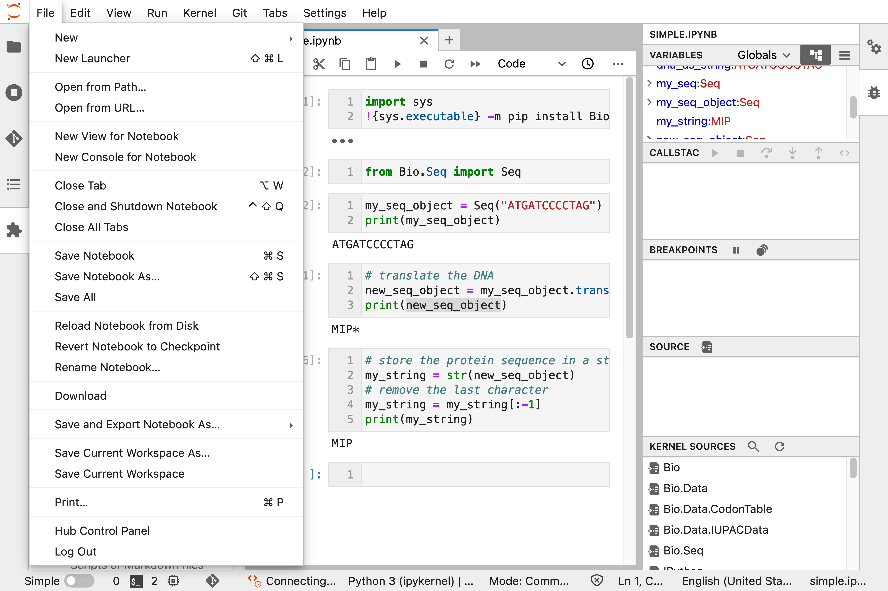

---
title: "Assignment 3"
author: [Course - Your name here]
colorlinks: TRUE
code-block-font-size: \footnotesize
...

# Assignment 3

The data for this assignment is available at this [link]([DATA_DOWNLOAD_LINK]).

## Question 1

### 10 marks

Question text goes here

### Answer

Information for marking

```texinfo
Can have text in texinfo blocks
```

```bash
echo "Or code in bash blocks"
```

## Question 2

### 20 marks

Another question

### Answer

Answer info

## Question 3

### 20 marks

A question with an image:


### Answer

Information for marking

```texinfo
Can have text in texinfo blocks
```

```bash
echo "Or code in bash blocks"
```


