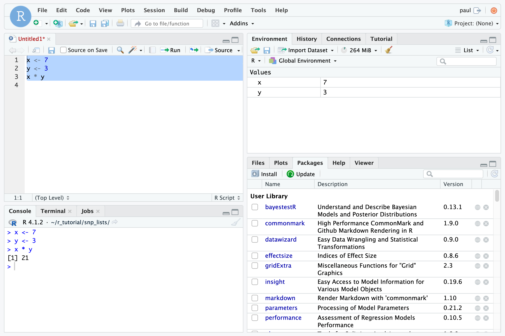

---
title: "Tutorial: R and RStudio"
author: [Your name here]
colorlinks: TRUE
code-block-font-size: \footnotesize
...

# R and RStudio

## Connecting to RStudio Server

RStudio is available as a free desktop application that you can install on your own computer and as a server (called RStudio Server) that can be accessed through a web browser.

## The RStudio panes

Once you are signed in you should see the following three RStudio panes:

- **Console** / **Terminal** pane (left)
- **Environment** / **History** pane (top right)
- **Files** / **Plots** / **Packages** / **Help** pane (bottom right)

A fourth pane, called the **Source** pane, appears in the top left when you create a new file or open an existing one.

Create a new R script now so that the **Source** pane is shown:

- Click **File** -> **New File** -> **R Script**.



## Typing R code in the Source pane

The **Source** pane is typically where you work when using RStudio. It is a text file editor where you can type or paste R commands.

Enter the following lines of code into the **Source** pane:

```r
x <- 7
y <- 3
x * y
```

The above sequence of commands stores the value `7` as an object called `x` (think of the `<-` as an arrow pointing to the object receiving the value), stores the value `3` as an object called `y`, and then multiplies the contents of `x` and `y`.

Note that when these commands are typed in the **Source** pane they are not automatically executed.

To run the commands, select all three in the **Source** pane and then press Ctrl+Enter.

The **Console** pane displays the R commands as they are run from the **Source** pane as well as textual output and error messages from those commands. When the above commands are run you should see the following output in the **Console** pane:

```texinfo
> x <- 7
> y <- 3
> x * y
[1] 21
```

The output value of `21` is shown.

The `[1]` next to the result is R indicating that this line begins with the first value in the result (some commands can return more than one value and their output can consume many lines). For example, the command `1:100` returns 100 values and the output is formatted as follows in the **Console** pane:

```texinfo
  [1]   1   2   3   4   5   6   7   8   9  10  11  12  13  14
 [15]  15  16  17  18  19  20  21  22  23  24  25  26  27  28
 [29]  29  30  31  32  33  34  35  36  37  38  39  40  41  42
 [43]  43  44  45  46  47  48  49  50  51  52  53  54  55  56
 [57]  57  58  59  60  61  62  63  64  65  66  67  68  69  70
 [71]  71  72  73  74  75  76  77  78  79  80  81  82  83  84
 [85]  85  86  87  88  89  90  91  92  93  94  95  96  97  98
 [99]  99 100
```

Next, edit the code in the **Source** pane, adding an additional line:

```r
x <- 7
y <- 3
result <- x * y
```

Run the revised code by selecting all three lines and pressing Ctrl+Enter.

Now in the **Console** pane you should see:

```texinfo
> x <- 7
> y <- 3
> result <- x * y
```

The product of `x` and `y` is no longer printed but instead is stored in an object called `result`.

You can save the contents of the **Source** pane at any time using **File** -> **Save**.

A typical RStudio session involves many iterations of typing commands in the **Source** pane, running them, and looking at the results in the **Console** pane.

## Running an R script

An R script is a series of R commands saved in a text file. Use **File** -> **Open File...** to open the R script called `upset_plot.R` located in the `r_tutorials` directory you downloaded.

This script makes use of an R package called `UpSetR`. A package is a collection of code, documentation, and other resources that provides new functionality to R. This particular package generates [UpSet plots](https://github.com/hms-dbmi/UpSetR), which are an excellent alternative to Venn diagrams when examining the overlap among sets.

In this example, lists of SNP consequences will be read from files and compared for overlaps and the results plotted. Each file consists of SNP per row, e.g.:

```texinfo
SNP
frameshift_variant c.102dupA p.Glu35fs
frameshift_variant c.1139_1140delCT p.Ser380fs
frameshift_variant c.1252_1253insT p.Gly418fs
frameshift_variant c.1292_1293insC p.Glu431fs
frameshift_variant c.16delA p.Ile6fs
```

The first command in this script, `library(UpSetR)`, loads the `UpSetR` package. For this command to work you first need to install the `UpSetR` package:

1. In the Packages pane click **Install**.
2. In the **Packages** text area enter `UpSetR` and click **Install**.

Once the package is installed you can run the script by selecting the text of the script and pressing Ctrl+Enter or by clicking **Run**. The comments in the script explain what some of the commands are doing.

The resulting plot (click the **Plots** pane if the plot isn't visible) shows the size of each SNP list (the **Set Size** portion of the plot) and the number of SNPs that are shared among each combination of files or that are unique to a file (the **Intersection Size** portion of the plot). For example, from the plot the following can be determined about analysis 6: 92 SNPs are unique to this analysis; 28 SNPs are found by this analysis and analyses 5, 3, and 1; 18 SNPs are found by this analysis and analyses 5 and 7; 4 SNPs are found by this analysis and analyses 5 and 1; and 1 SNP is found by this analysis and analysis 7. Note that 92 + 28 + 18 + 4 + 1 = 143 which is the number of SNPs described in the `SNPs_analysis_6.csv` file.

To save a plot click **Export** in the **Plots** pane. The PDF or image file can then be downloaded in the **Files** pane using **More** -> **Export...** and then **Download**.


