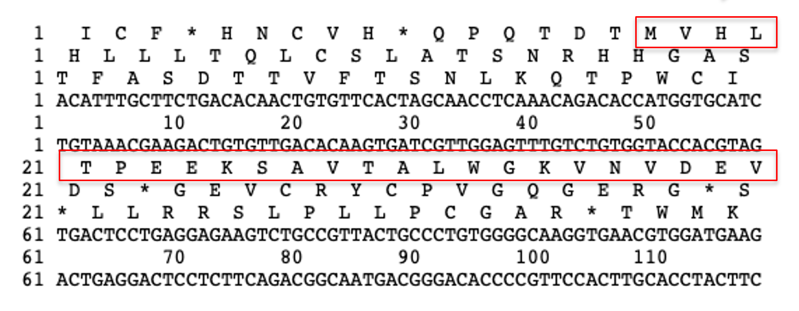
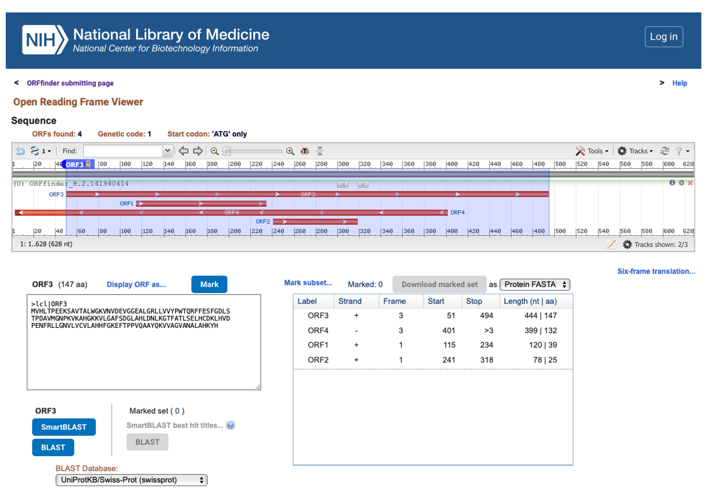

# Assignment 1

This is an assignment.

## Question 1

### 1 mark

Question text goes here

### Answer

Information for marking

```texinfo
Can have text in texinfo blocks
```

```bash
echo "Or code in bash blocks"
```

## Question 2

### 2 marks

Another question

### Answer

Answer info

## Question 3

### 2 marks

A question with an image:



### Answer

```texinfo
Can have text in texinfo blocks
```

```bash
echo "Or code in bash blocks"
```


