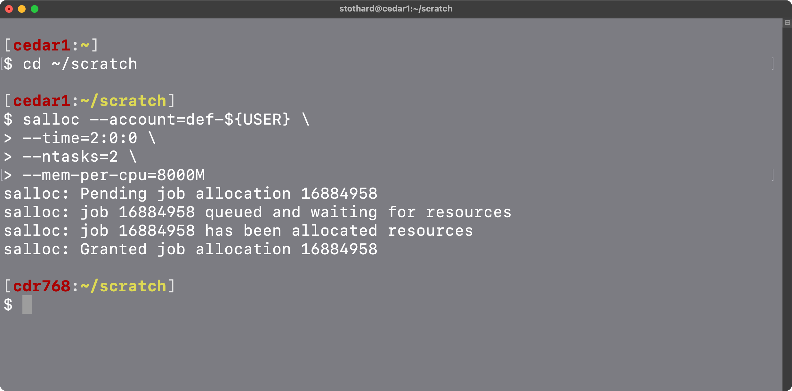
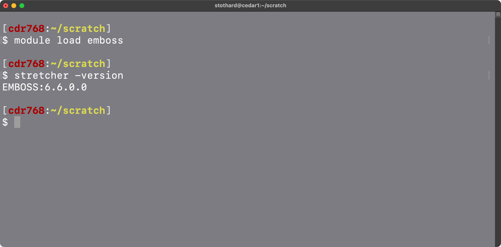

# High-performance computing

High-performance computing (HPC) typically refers to using parallel data processing across multiple computers in order to analyze large data sets in a timely manner. HPC works well for many bioinformatics applications, because many of the analysis steps can proceed independently (e.g. at the same time on different computers).

### Running an interactive job

Due to the possibility of being disconnected from the cluster, you may want to use `tmux` or `screen` when running interactive jobs. These programs allow you to disconnect from a terminal session and reconnect later. For example, before requesting the interactive job create a `tmux` session:

```bash
$ tmux new -s myjob
```

This will create a new `tmux` session named `myjob`. You can then request the interactive job and run your commands. If you are disconnected (or if you detach using `Ctrl + b` then `d`) you can reattach to the `tmux` session:

```bash
$ tmux attach -t myjob
```

Note that there may be multiple login nodes, and you may be connected to a different login node when you reconnect. If you are unable to reconnect to the `tmux` session, try connecting to a different login node. For example, if you were on the `cedar1` login node when you created the `tmux` session, but are now on the `cedar5` login node, you can quickly switch to the `cedar1` login node using `ssh cedar1`.

If you find that you are frequently disconnected from the cluster, try adding the following to the `~/.ssh/config` file **on your computer** before connecting to the cluster:

```texinfo
Host *
    ServerAliveInterval 300
    ServerAliveCountMax 5
    TCPKeepAlive yes
```

On the login node request an interactive job:

```bash
$ cd ~/scratch
$ salloc --account=def-${USER} \
--time=2:0:0 \
--ntasks=2 \
--mem-per-cpu=8000M
```



The `salloc` options mean the following:

| Option                 | Meaning                                  |
| ---------------------- | ---------------------------------------- |
| --account=def-someuser | Use the default allocation for this user |
| --time=2:0:0           | Reserve the compute node for 2 hours     |
| --ntasks=2             | Reserve 2 CPU cores                      |
| --mem-per-cpu=8000M    | Reserve 8000MB of RAM per CPU            |

You can request longer times and more RAM and CPU resources. However, the more you request the more likely your `salloc` command will leave you waiting for the resources to become available.

Once the allocation is available you will be logged in to a compute node where you are free to run your commands. You will have access to the same files and folders as on the login node, and any files you create on a compute node will be accessible afterwards from the login node.

Typically you work within the `~/scratch` folder when using compute nodes, hence the `cd ~/scratch` prior to requesting the allocation. When you exit the compute node you can continue to access the contents of this folder from the login node. Note that the contents of `~/scratch` are regularly removed by administrators (with warning) so don't use it for long-term storage. Place files that you want to keep in your `project` folder. Each research group is given a default allocation of 1 TB of "project" storage.

To use a module, e.g. `emboss`:

```bash
$ module load emboss
```

Once loaded you can use the usual commands for that package, e.g.:

```bash
$ stretcher -version
```



Download some data using the following command:

```bash
$ cd ~
$ wget \
[DATA_DOWNLOAD_LINK] \
-O hpc_tutorial.zip
$ unzip hpc_tutorial.zip
```
